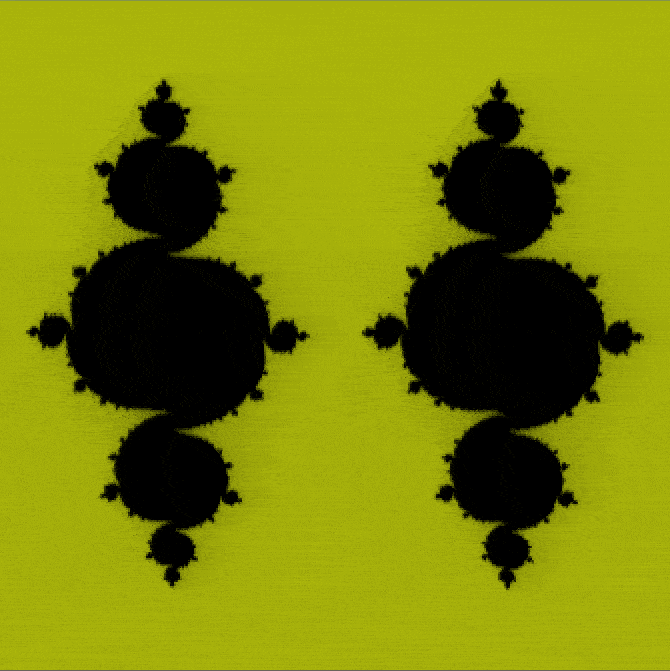

# Taichi 移动端测试

利用Taichi AOT模式进行移动端性能测试；
在Android端运行测试程序需要：
1. 从内部Taichi仓库的`impl-quant-spirv`分支编译taichi编译器;
2. 从内部taichi-unity2仓库的`add-android-build`仓库编译`taichi-unity.so`和`taichi_c_api.so`；
3. 按照下面的说明，把`taichi-unity.so`和`taichi_c_api.so`放到`Assets/Plugins/Android`目录下；
4. 重新运行`scripts/`目录下的mpm.quant.py脚本，生成aot module.

   ```python scripts/mpm.quant.py --aot -q，其中`-q`参数表示是否开启量化；```
5. 在Unity中编译打包；

--- 
# Taichi-UnityExample

This repository demonstrates Taichi-Unity interopability with sample scenes.

🔥 The Unity examples are still in active development. Things can break sometimes but will be fixed real soon.

<div align=center>
 
</div>

## Prerequisites

If you have installed any recent version of Unity (2022.3.14 or above), this project is runnable out-of-the-box. You don't need to build taichi libraries because all the necessary native plugins are already included in `Assets/Plugins`, but in case you want to, consult [taichi-dev/taichi](https://github.com/taichi-dev/taichi) and [taichi-dev/taichi-unity2](https://github.com/taichi-dev/taichi-unity2) for building manuals.

If you want to create another Unity Project with Taichi integration, you need to set your first-choice graphics API to Vulkan in *Player Settings* in Unity because currently Taichi C-API doesn't support other graphics APIs at the moment.

## Packaging

You can head for `File - Build Settings` to configurate and package the game application. Currently the examples can only be build for Android and Windows PC using the Vulkan API. Please refer to [Unity documentations](https://docs.unity3d.com/Manual/BuildSettings.html) for detail. Prebuilt releases could be found on [the release page](https://github.com/taichi-dev/Taichi-UnityExample/releases).

## Content

This repository presents several demo scenes, each can be found in `Assets/Scenes`:

- `Fractal`: A simple time-dependent texture generation kernel;
- `ImplicitFem`: A physically-based soft-body simulation emitting vertex data on-the-flight.

Also note that the project can be built into Unity Player.

## Notes for Android

Note that some player settings are changed for Android

- Minimum version is changed to 26 (Android Oreo), which is the version the native libraries are compiled;
- Scripting backend is switched to IL2CPP;
- Library arch is set to `ARM64`, support for `ARMv7` is canceled;
- Default orientation is fixed portrait.
## Problem and solution
We sorted out the problems you may encounter while running the demo, and will continue to add. You can find them at [Build.md](Build.md).
